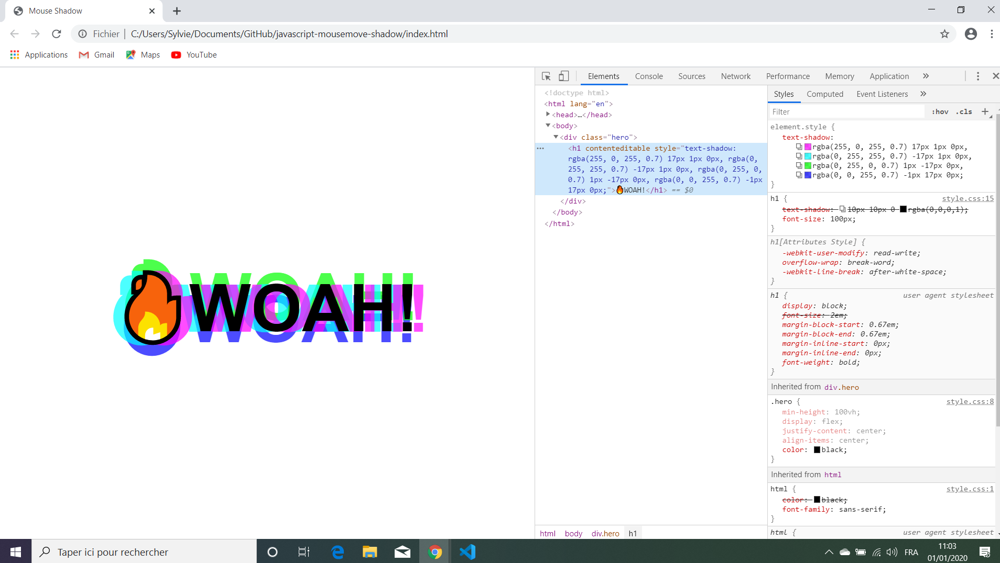

# :zap: Javascript Mousemove Shadow

Wes Bos Youtube Tutorial: [CSS Text Shadow on Mouse Move Effect - #JavaScript30 16/30](https://www.youtube.com/watch?v=zaz9gLI-Xac&list=PLu8EoSxDXHP6CGK4YVJhL_VWetA865GOH&index=17&t=0s).
* **Note:** to open web links in a new window use: _ctrl+click on link_


## :page_facing_up: Table of contents

* [General info](#general-info)
* [Screenshots](#screenshots)
* [Technologies](#technologies)
* [Setup](#setup)
* [Features](#features)
* [Status](#status)
* [Inspiration](#inspiration)
* [Contact](#contact)

## :books: General info

* Tutorial Code using text-shadow property to move shadow around text when mouse is moved.

## :camera: Screenshots

.

## :signal_strength: Technologies

* [Javascript ECMA-262 ECMAScript 2020](http://www.ecma-international.org/publications/standards/Ecma-262.htm)

## :floppy_disk: Setup

* Open index.html in browser. If any code is changed the browser needs to be refreshed.

## :computer: Code Examples

* position of x and y coordinates includes offset from left and top.

```javascript
  if (this !== e.target) {
    x = x + e.target.offsetLeft;
    y = y + e.target.offsetTop;
  }
```

## :cool: Features

*  Can change colours and distance of shadows from header.

## :clipboard: Status & To-Do List

* Status: Working.
* To-Do: try different values in formulae to see effect on shadow, add other text properties.

## :clap: Inspiration

* Wes Bos Youtube Tutorial: [CSS Text Shadow on Mouse Move Effect - #JavaScript30 16/30](https://www.youtube.com/watch?v=zaz9gLI-Xac&list=PLu8EoSxDXHP6CGK4YVJhL_VWetA865GOH&index=17&t=0s).

## :file_folder: License

* N/A

## :envelope: Contact

* Repo created by [ABateman](https://github.com/AndrewJBateman), email: gomezbateman@yahoo.com
